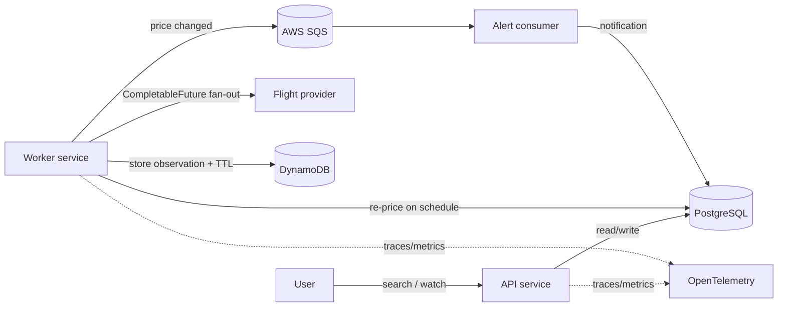

# SkyFare

**Status: actively in development** — backend API and worker are functional and tested; React front end and Kubernetes deployment are in progress.

A flight fare search and price-alert platform. Personal project, built to stay current with cloud-native backend patterns: concurrent I/O, polyglot persistence, event-driven messaging, and production observability.

**Stack:** Java 21 · Spring Boot 3 · PostgreSQL + Flyway · DynamoDB · AWS SQS · Docker · Kubernetes (in progress) · GitHub Actions · OpenTelemetry · JUnit / Mockito / Testcontainers · JaCoCo

---

## What it does

1. **Search** a route across a flexible date window. Each date is priced concurrently on a bounded thread pool, not in a sequential loop.
2. **Watch** a route with a target price (stored in PostgreSQL).
3. A **worker** service re-prices every watched route on a schedule, stores each observation in **DynamoDB** (with TTL), and publishes a `FareChangedEvent` to **SQS** when the price moves.
4. An **alert consumer** reads the queue and creates a notification when the fare crosses the user's target.



One Spring Boot artefact runs in two roles: default profile is the API, `worker` profile is the poller plus the alert consumer. Same image, same code, different `SPRING_PROFILES_ACTIVE`.

## Why it's built this way

- **Concurrent search, not sequential.** Pricing five dates one after another would take ~1.3s at 250ms each. Fanning them out on a bounded thread pool with `CompletableFuture` brings that under 500ms, and a failure on one date doesn't take down the rest of the search. See `SearchServiceTest.fansOutConcurrentlyRatherThanSequentially`.
- **PostgreSQL and DynamoDB, each doing the job it's good at.** Relational data (users, watches) stays relational. High-write, TTL-expiring fare history goes in DynamoDB rather than bloating a Postgres table that nobody queries historically.
- **SQS decouples pricing from alerting.** The poller doesn't know or care who's listening for a price change; it just publishes. The consumer doesn't know how a price was computed; it just reacts.
- **Observability is built in, not bolted on.** The OpenTelemetry Java agent auto-instruments Spring MVC, JDBC and the AWS SDK; manual spans around each fare lookup make the concurrent fan-out visible as a waterfall in Jaeger, not just a single opaque request.

## Run it locally

Prerequisites: Docker (OrbStack or Docker Desktop), JDK 21, Maven.

```bash
docker compose up --build
```

| Endpoint | URL |
|---|---|
| API health | http://localhost:8080/actuator/health |
| Swagger UI | http://localhost:8080/swagger-ui.html |
| Prometheus metrics | http://localhost:8080/actuator/prometheus |
| Jaeger traces | http://localhost:16686 |

```bash
# register and capture a token
TOKEN=$(curl -s -X POST localhost:8080/api/auth/register \
  -H 'Content-Type: application/json' \
  -d '{"email":"me@example.com","password":"password123"}' | jq -r .token)

# timed search — compare this to 5 x 250ms sequential
time curl -s "localhost:8080/api/search?origin=ADL&destination=SYD&date=2026-10-15&flexDays=2" | jq

# watch a route with a generous target so the worker's first poll fires an alert
curl -s -X POST localhost:8080/api/watches \
  -H "Authorization: Bearer $TOKEN" -H 'Content-Type: application/json' \
  -d '{"origin":"ADL","destination":"SYD","departDate":"2026-10-15","targetPrice":600}' | jq

# wait ~60s for the worker's first poll, then:
curl -s localhost:8080/api/notifications -H "Authorization: Bearer $TOKEN" | jq
```

## Tests

```bash
mvn verify
```

`WatchFlowTest` runs the full register → watch → list flow through MockMvc against a real PostgreSQL via Testcontainers, not a mock. Coverage report lands at `target/site/jacoco/index.html`.

## Roadmap

- [x] API: auth, concurrent search, watchlist, notifications
- [x] Worker: scheduled re-pricing, DynamoDB history, SQS event publishing
- [x] Alert consumer: SQS → notification
- [x] Observability: OpenTelemetry traces + Micrometer/Prometheus metrics
- [x] CI: GitHub Actions running unit + Testcontainers integration tests with JaCoCo
- [ ] React front end
- [ ] Kubernetes manifests + Helm chart
- [ ] Public deployment

## Configuration

All config is environment-driven; see `application.yml`. Credentials are never in config — the AWS SDK's default provider chain is used. `AWS_ENDPOINT` points at LocalStack for local development and is left blank for real AWS.
